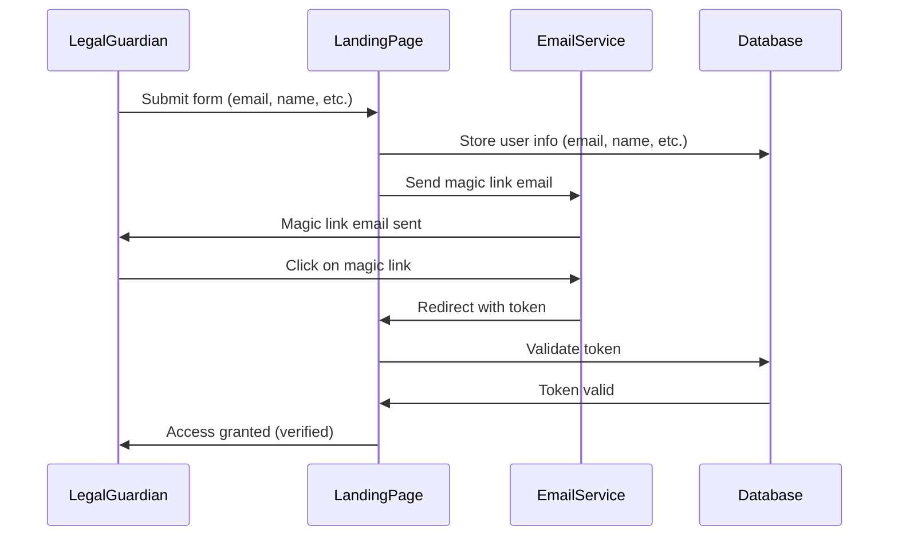
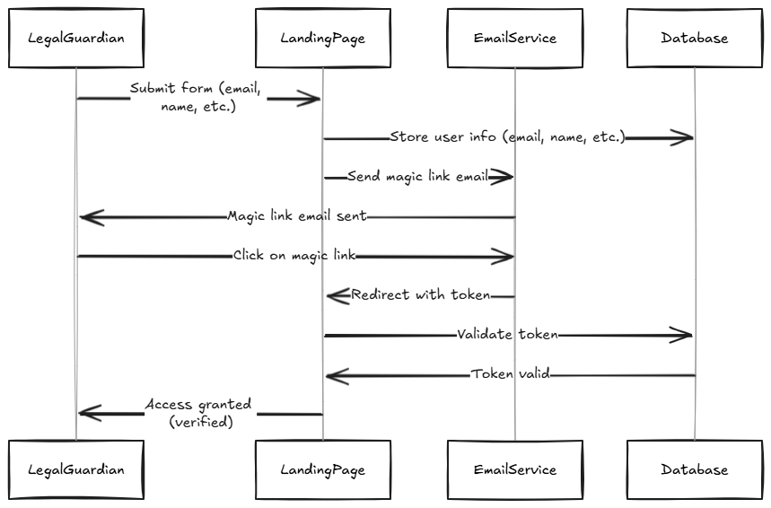
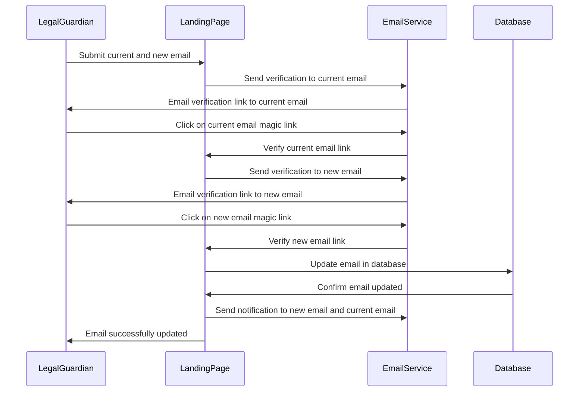
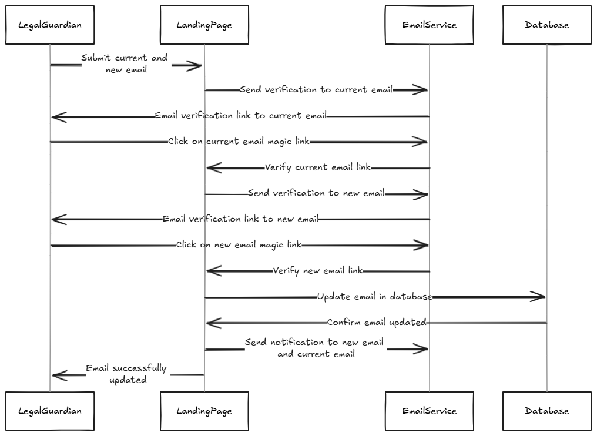

# 2a. Onboarding Process to Guarantee Valid Emails

By enforcing email verification before allowing any actions like, we ensure that:
 * **Data Integrity**: Only verified participants can submit information, which adds credibility and trustworthiness to the data.
 * **Audit Trail**: You have a clear, documented trail of actions, starting from email verification, through to submission, which is essential for regulatory compliance and future audits.
 * **Security**: Email verification minimizes the risk of unauthorized submissions or malicious uploads, making sure that each interaction is tied to a verified user.

## Process to Validate Email

The email validation process ensures that the legal guardian's email address is verified before accessing further steps in the system. Upon submitting the initial form with the required details (e.g., email and name), the system sends a magic link to the provided email address.

1. The legal guardian submits the form with their email.
2. The system stores the information in the database and sends a magic link via email.
3. The legal guardian clicks the magic link, which redirects them to the verification page.
4. The system verifies the token associated with the magic link and updates the database.
5. If valid, the legal guardian is granted access.

## Process to update email

This process allows a legal guardian to update their email address by submitting both their current and new emails. Verification of both the current and new emails ensures the legitimacy of the request.

1. The legal guardian submits their current and new email addresses.
2. The system sends a verification link to the current email address.
3. The legal guardian clicks the link in the current email to confirm the request.
4. The system then sends a verification link to the new email address.
5. The legal guardian verifies the new email by clicking the link.

Upon successful verification, the system updates the email in the database and notifies both the old and new email addresses of the change.

