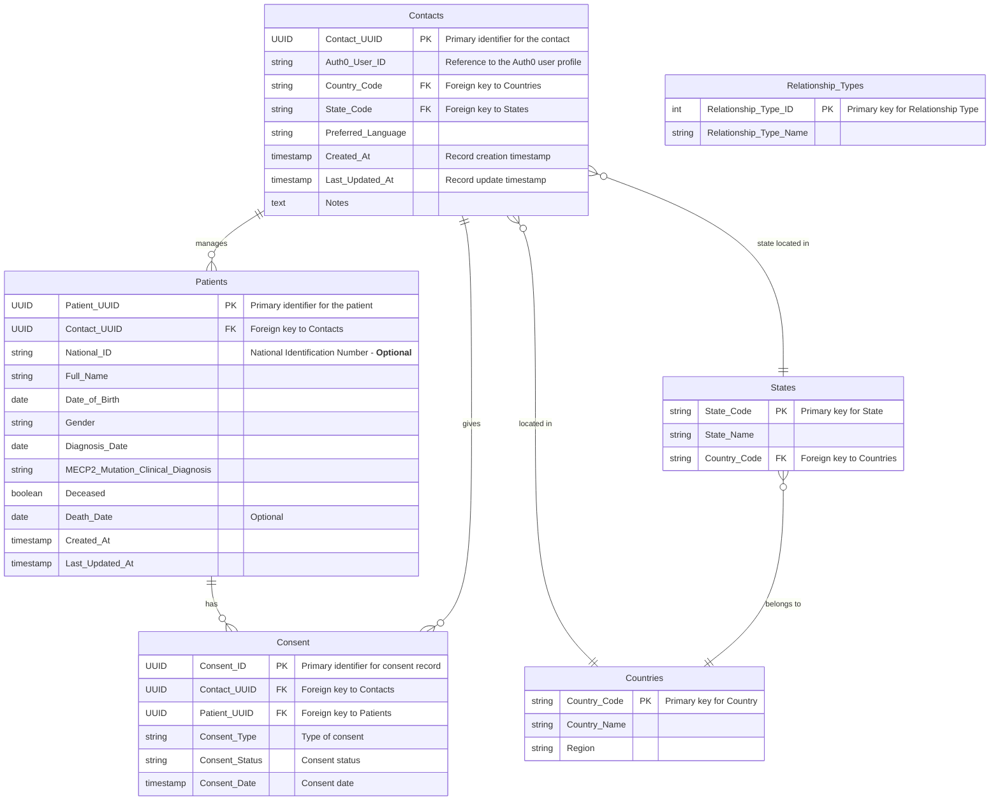

# Data Model

With Auth0 handling user profile information, we will use a simplified `Contacts` entity in the data model by removing some fields and leveraging Auth0 for authentication and basic profile management.

## Adjusted Data Model

### 1. Auth0 Integration
* User information like email, name, and mobile number will be stored in Auth0.
* Auth0 will handle email verification, status, and other attributes related to authentication.

### 2. Contacts
Stores additional information related to legal guardians, caregivers, or individuals who are responsible for patients, not managed by Auth0.
* Fields: `Contact_UUID`, `Auth0_User_ID`, `Country_Code`, `State_Code`, `Preferred_Language`, `Created_At`, `Last_Updated_At`, `Notes`.

### 3. Patients
Stores detailed information about the patient, including personal information, demographics, and clinical data.
* Fields: `Patient_UUID`, `Contact_UUID` (foreign key to Contacts), `National_ID`, `Full_Name`, `Date_of_Birth`, `Gender`, `Diagnosis_Date`, `MECP2_Mutation_Clinical_Diagnosis`, `Deceased`, `Death_Date`, `Created_At`, `Last_Updated_At`.
* Each patient is linked to a contact, who is their legal guardian or caregiver.

### 4. Consent management
Manages consent information related to data sharing, research participation, or other specific permissions for each patient.
* Fields: `Consent_ID`, `Contact_UUID` (foreign key to Contacts), `Patient_UUID` (foreign key to Patients), `Consent_Type`, `Consent_Status`, `Consent_Date`.
* This structure allows flexibility in managing multiple types of consent for each patient, such as data sharing or participation in specific studies.
* Consent records are linked to both the contact (legal guardian) and the patient, ensuring that each consent is clearly traceable to the responsible party.

## Data Model Diagram

