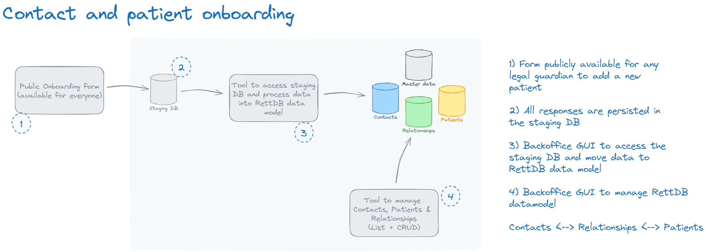
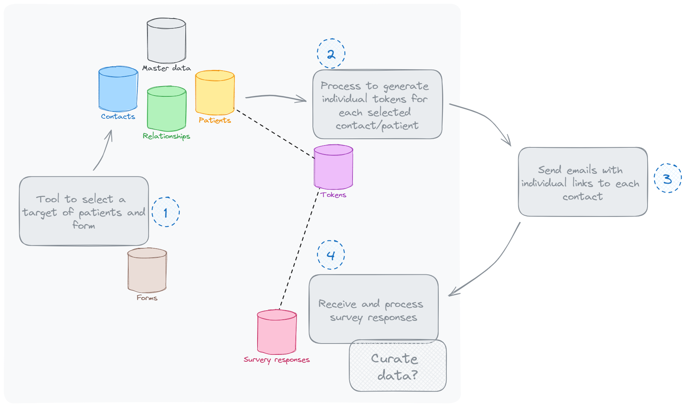

# Rett Syndrome Patient Registry - Functional Documentation

## 1. Overview

The Rett Syndrome Patient Registry is a system designed to collect, store, and manage data related to patients with Rett Syndrome. The system focuses on gathering essential contact, patient, and longitudinal data through various forms and surveys, ensuring secure and compliant data management.

The system provides administrators with tools to manage the data, while ensuring that contacts (legal guardians) can securely contribute relevant patient information. It is designed with GDPR compliance in mind, leveraging secure file handling and encryption protocols. The system integrates with the Microsoft ecosystem for user management and access control, providing a seamless experience for authorized personnel within the organization.

### Key Objectives:
- **Onboarding**: Provide a public form where legal guardians can onboard themselves and their associated patients without requiring authentication.
- **Data Management**: Enable the administration of contacts, patients, and relationships through a backoffice tool.
- **Longitudinal Data Collection**: Facilitate the continuous collection of patient data over time via secure surveys linked to specific patients.
- **File Upload**: Provide a secure mechanism for legal guardians to upload files, such as genetic reports, that are linked to patients.
- **User Management**: Leverage the Microsoft 365 ecosystem for authentication and authorization, ensuring that all user access is managed securely.
- **Security & Compliance**: Ensure the system complies with GDPR and maintains high standards for data encryption and protection.

---

## Key Functional Areas

### 1. Public Onboarding
The onboarding form is publicly accessible and allows contacts (legal guardians) to register themselves and the patients under their care. No authentication is required to complete the form, and all submissions are stored in a staging database for review before final entry into the master database.

- **Fields Collected**: 
  - Contact: Full Name, Email, Mobile, Country, State, Relationship to Patient
  - Patient: Full Name, Date of Birth, Gender, MECP2 Mutation (or clinical diagnosis)

- **Data Flow**: Submissions are first stored in the staging database and validated before being moved to the master database.

### 2. Staging Database and Data Processing
The staging database temporarily stores data from the onboarding form. Data must be validated (e.g., deduplication checks) before being moved to the master database, which contains the primary records for contacts, patients, and their relationships.

- **Processing Workflow**: Data validation, deduplication, and transfer to the master database.

### 3. Master Data
The master database contains all validated records of contacts, patients, and their relationships. Relationships define the connections between contacts (e.g., legal guardians) and patients (e.g., mother, father, legal guardian).

- **Entities**: 
  - Contacts: Legal guardians or caregivers.
  - Patients: Individuals diagnosed with Rett Syndrome.
  - Relationships: Connections between contacts and patients.

### 4. Backoffice Application (CRUD)
The backoffice application allows administrators to perform full CRUD operations on contacts, patients, and their relationships. It includes list views, search functionality, and allows for adding, updating, and deleting records.

- **Functionalities**:
  - CRUD operations for contacts, patients, and relationships.
  - List and search features for managing data.

### 5. Longitudinal Data Collection
The registry supports the collection of longitudinal data by allowing administrators to send surveys to contacts at different intervals. Each survey is linked to the corresponding patient through a secure, tokenized system, ensuring data integrity.

- **Process**:
  - Select a subset of patients.
  - Generate private links using individual tokens.
  - Send email notifications to contacts with unique links.
  - Process survey responses and associate them with the correct patient.

### 6. Secure File Upload
The system includes a secure file upload feature where legal guardians can upload files (e.g., genetic reports) using a private, token-based link. These files are securely stored and linked to the appropriate patient, ensuring GDPR compliance.

- **File Linking**: Each uploaded file is associated with a patient and stored securely in an encrypted environment.

### 7. User Management (Microsoft 365 Integration)
All user management is handled through the Microsoft 365 ecosystem, ensuring that only authorized personnel within the organization can access the system. The system uses Single Sign-On (SSO) and Role-Based Access Control (RBAC) for managing user permissions.

- **Roles**: Admin, Data Manager, Viewer.
- **Authentication**: Handled via Microsoft Azure AD and SSO.

### 8. Security and GDPR Compliance
The system is fully compliant with GDPR regulations, ensuring that all personal and sensitive data is protected. Explicit consent is required from contacts when submitting data or uploading files. The system uses encryption for data both at rest and in transit.

- **Security Features**:
  - Data encryption (at rest and in transit).
  - Role-based access control.
  - GDPR-compliant consent management.

### 9. Reporting and Analytics
The system integrates with reporting tools like PowerBI to allow administrators to generate detailed reports on patient demographics, mutation data, and longitudinal trends. All reports are anonymized to ensure privacy.

- **Capabilities**:
  - Anonymized reporting.
  - Exporting data for external analysis.

---