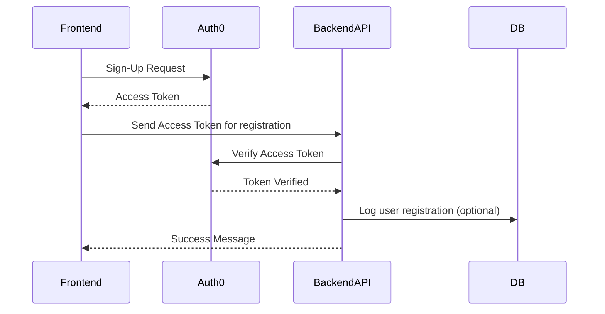
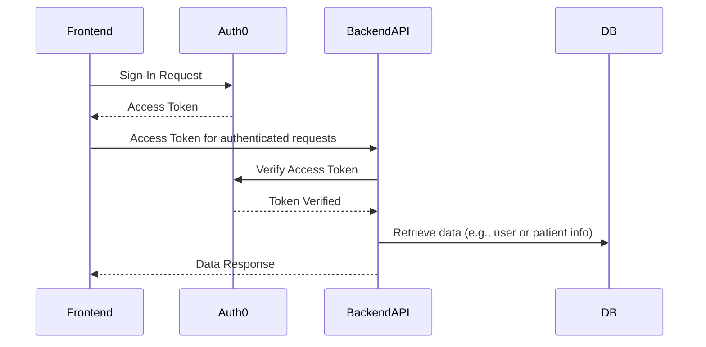
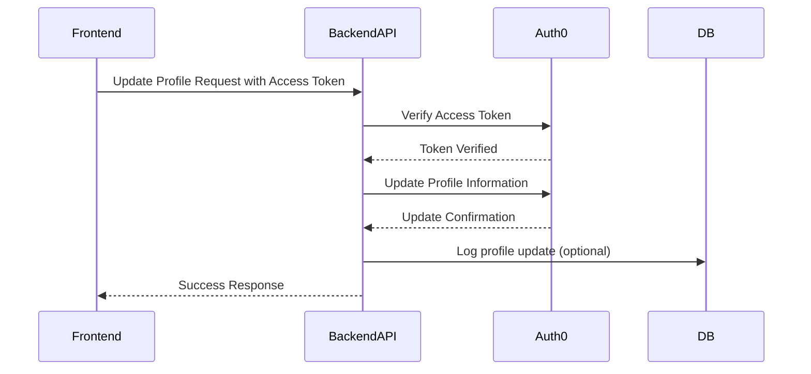
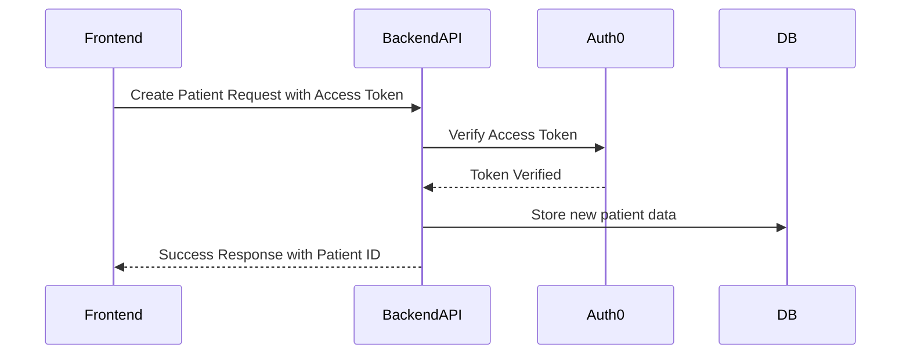
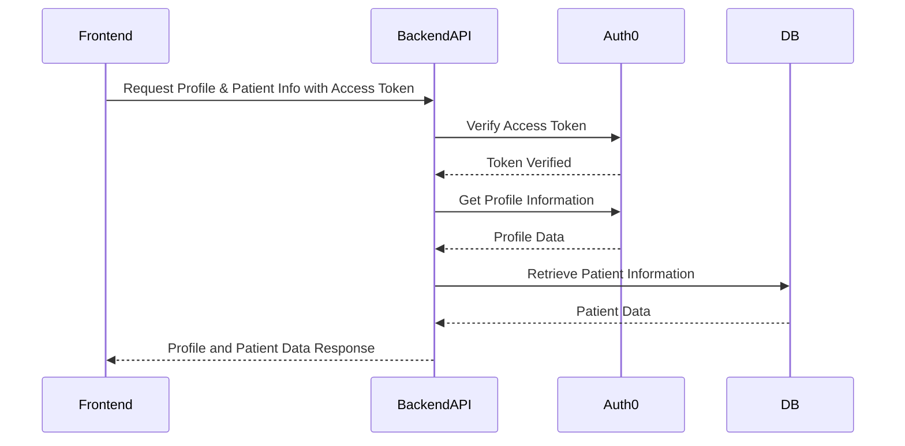

# Front-end / Back-end Interaction

## User Profile Creation / Sign-up

In this sequence, a new user signs up and creates their profile through **Auth0**, which then authenticates the user with an access token. The **Backend API** logs the user registration in the **DB** if needed.

## User Sign-In

This sequence shows the user sign-in process. **Auth0** authenticates the user and provides an access token, which the **Frontend** uses to make authenticated requests to the **Backend API**. The **Backend API** verifies the token, retrieves necessary data from the **DB**, and returns it to the **Frontend**.

## Update User Profile

In this sequence, a user requests to update their profile information. The **Backend API** receives the request, verifies the token with **Auth0**, and updates the user profile in **Auth0**. Any necessary logs can also be saved to the **DB**.

## Create a New Patient

This sequence shows how a new patient entry is created. The **Frontend** sends a request to create a new patient, which the **Backend API** verifies with **Auth0**. Upon successful verification, the **Backend API** stores the patient data in the **DB** and confirms with the **Frontend**.

## Get User and Patient Information

In this sequence, the **Frontend** requests both profile and patient information. The **Backend API** verifies the user’s token with **Auth0**, retrieves profile information from **Auth0** and patient data from the **DB**, and sends both back to the **Frontend**.

