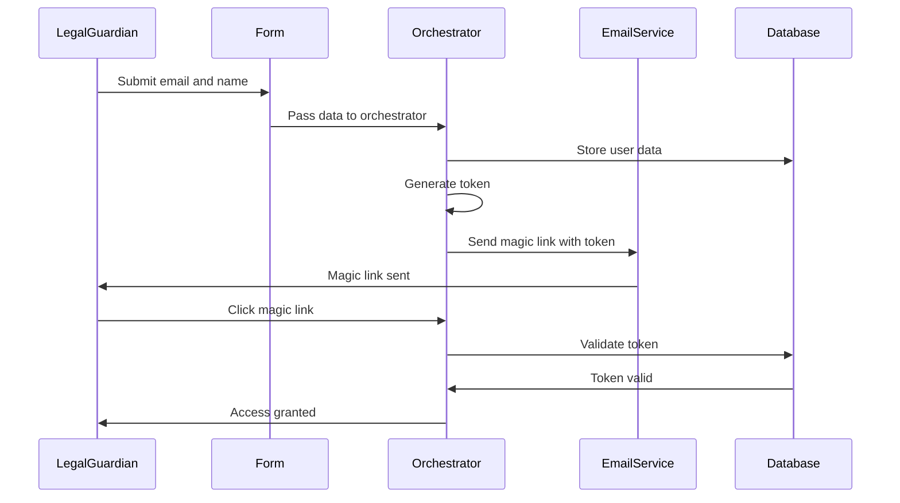
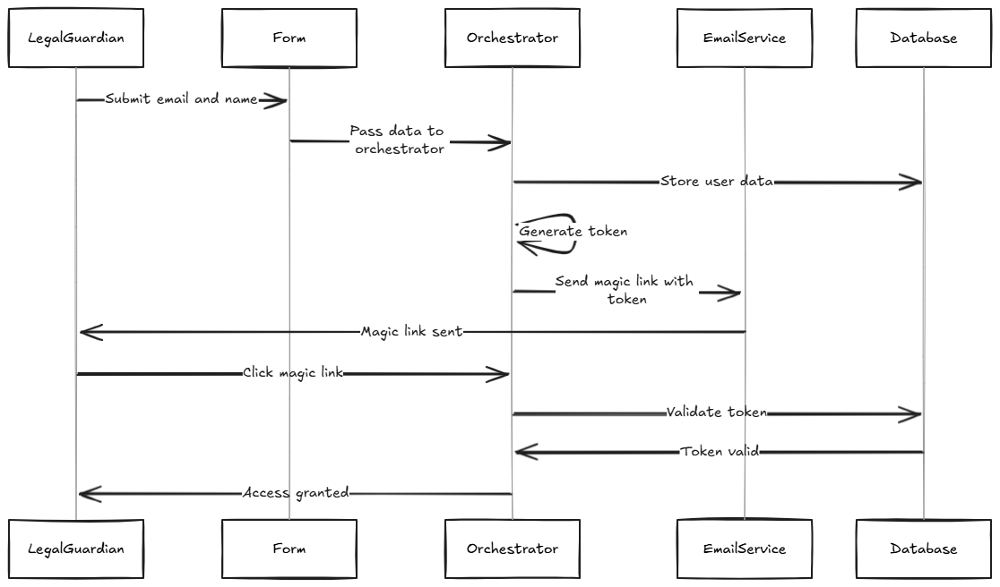
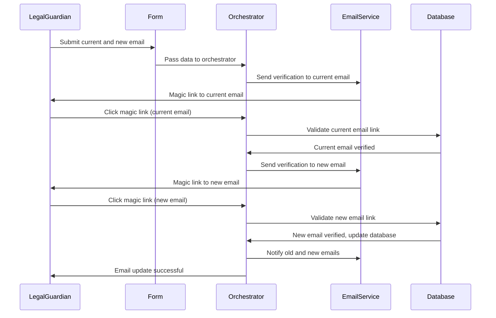
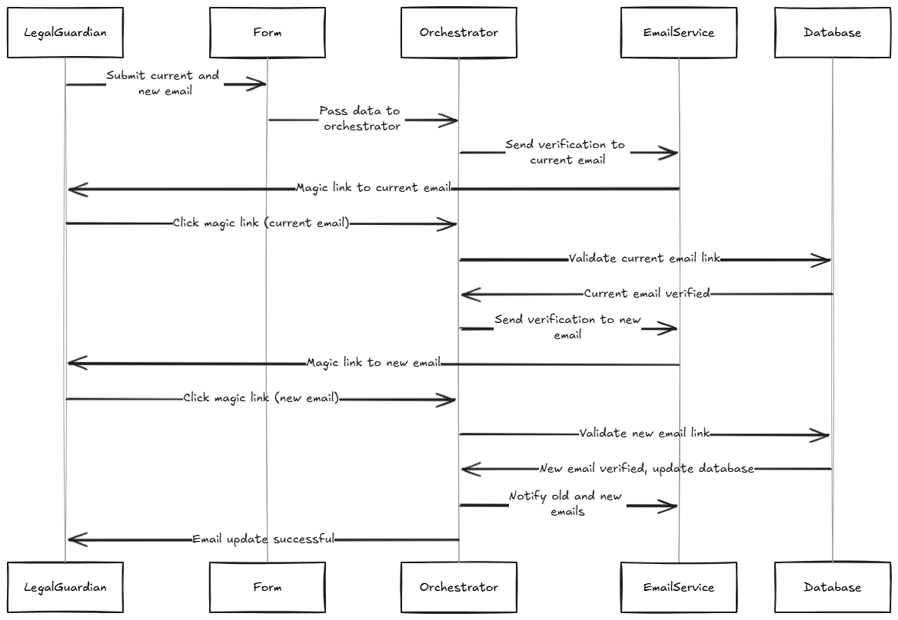

# 2a. Onboarding Process to Guarantee Valid Emails (With Orchestrator)

### Overview
The email verification process ensures that each legal guardian or participant has a valid email before taking any action. This serves to:
- **Guarantee Data Integrity**: Only verified participants can submit sensitive information, maintaining high data accuracy and trustworthiness.
- **Maintain an Audit Trail**: All interactions begin with verified users, supporting traceability and regulatory compliance.
- **Enhance Security**: Prevent unauthorized access or submissions by ensuring that only users with valid emails proceed.

### Email Verification Process with Orchestrator

When the user provides their email during onboarding, a verification step is required before granting further access to the system or allowing submission of any information (such as patient details). The orchestrator is responsible for managing the flow, including token generation, sending the magic link, and handling token validation.

#### Step-by-Step Process:

1. **Email Collection**: 
   - The legal guardian enters their email and any other required details (such as name) through the onboarding form.
   - The form passes the collected data to the **Orchestrator** for further processing.
   
2. **Send Magic Link**:
   - The **Orchestrator** generates a time-limited, single-use magic link and sends it to the provided email address using an email service.
   
3. **Email Verification**:
   - The legal guardian clicks on the magic link. Upon redirection, the **Orchestrator** verifies the token associated with the magic link.
   - If the token is valid and hasn't expired, the user is verified, and the system updates the database accordingly.
   
4. **Access Granted**:
   - Once the email is verified, the legal guardian is granted access to submit additional information or take further actions.

#### Diagram:

### Email Verification Features:
- **Time-limited Token**: The magic link expires after a certain period (e.g., 24 hours), after which the user must request a new link.
- **Single-use**: The token can only be used once, preventing reuse of the link.
- **Security Enhancements**: Include email encryption in transit and verification logs for compliance purposes.

---

## Process to Update Email

Legal guardians may need to update their email at some point. The following process ensures that both the current and new emails are verified before an email address can be changed in the system. This avoids unauthorized email changes and ensures that audit trails remain intact.

#### Step-by-Step Process:

1. **Submit Current and New Email**: 
   - The legal guardian submits both their current and new email addresses through a secure form.
   
2. **Verify Current Email**:
   - The **Orchestrator** sends a magic link to the current email address, asking the guardian to confirm the request to update their email.
   
3. **Verify New Email**:
   - Upon successful verification of the current email, the **Orchestrator** sends a second magic link to the new email address.
   
4. **Update Email**:
   - After both emails are verified, the **Orchestrator** updates the legal guardian’s email in the database and sends confirmation notifications to both the old and new emails.

#### Diagram:

### Key Considerations:
- **Security**: Ensures both the current and new emails are verified before any update takes place.
- **Auditability**: The process is fully logged to maintain a traceable history of any email changes.

---

## Enhancements and Flexibility:

1. **Resend Magic Link**:
   - If the user doesn’t receive the magic link (e.g., due to email filters), they should have an option to request another link.

2. **Token Expiry Management**:
   - Implement clear error messages and guidance when the token has expired, directing users to request a new magic link.

3. **Audit Logs**:
   - Every email verification and email update attempt should be recorded in the audit logs, including the timestamps and status (success/failure). This helps with compliance and security checks.

4. **Optional Two-Factor Authentication (2FA)**:
   - For added security, consider including an option for **2FA** (e.g., SMS or an authentication app) in addition to email verification, especially when updating sensitive data.

5. **Multi-language Support**:
   - Depending on the geographic scope of the registry, consider adding multi-language support to all email notifications and onboarding pages to accommodate a diverse user base.
