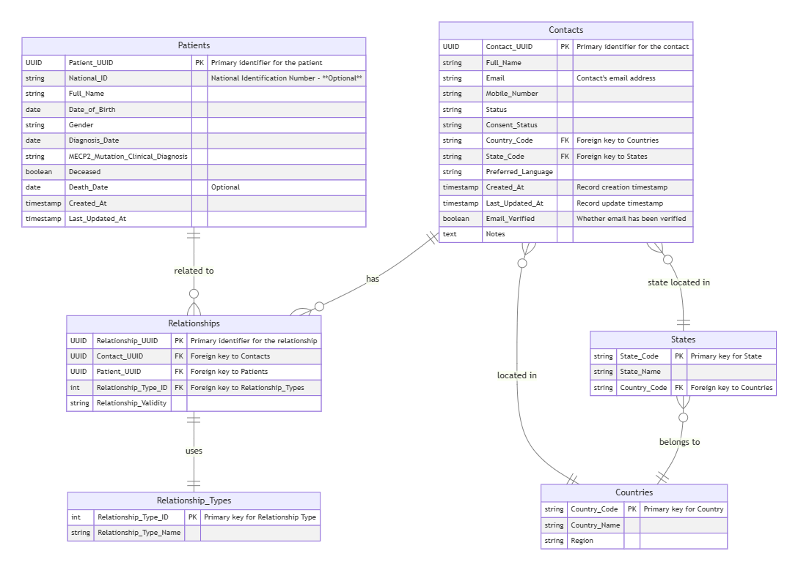
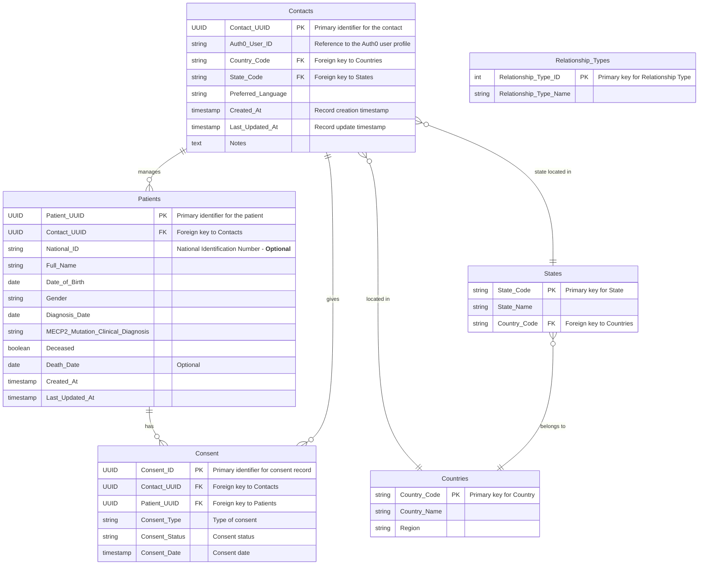

# Data Model

With Auth0 handling user profile information, we will use a simplified `Contacts` entity in the data model by removing some fields and leveraging Auth0 for authentication and basic profile management.

## Adjusted Data Model

### 1. Auth0 Integration
 * User information like email, name, and mobile number will be stored in Auth0.
 * Auth0 will handle email verification, status, and other attributes related to authentication.

### 2. Contacts
 * Stores information related to legal guardians, caregivers, or individuals who are responsible for patients. This includes additional details not managed by Auth0, such as country, state, preferred language, and notes.

 * **DECISION NEEDED:** Should the contact profile info be entirely stored in Auth0, since it allows usual profile info and also custom information
 https://auth0.com/docs/manage-users/user-accounts/metadata

### 3. Patients
 * Contains personal, demographic, and clinical information about the patient. Each patient is linked to a contact, representing their legal guardian or caregiver.

### 4. Consent Management
 * Manages consent information for each patient, covering data sharing, research participation, and other specific permissions. Consent records are linked to both the contact (legal guardian) and the patient, ensuring that each consent is clearly traceable to the responsible party. This structure provides flexibility to manage multiple types of consent for each patient.

## Data Model Diagram

