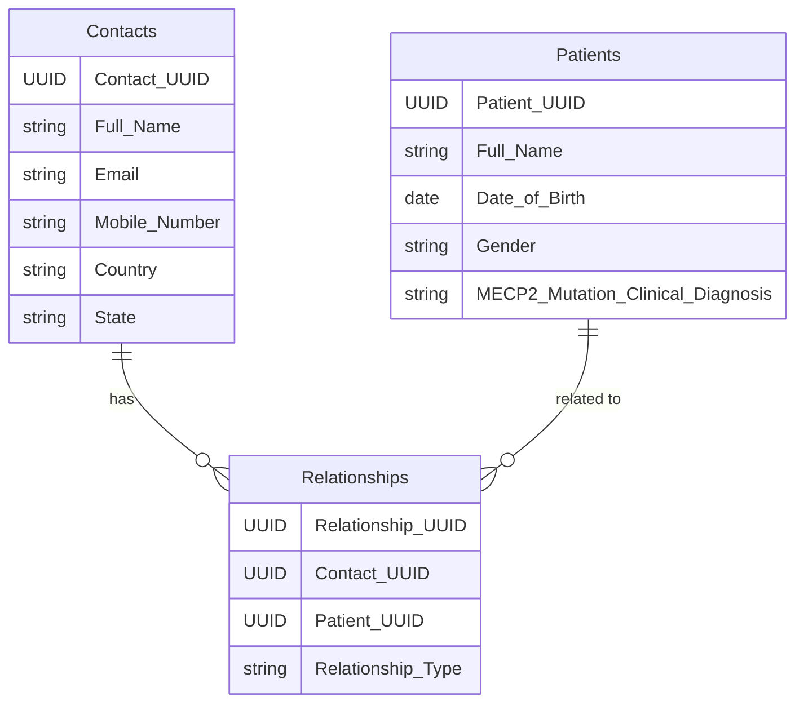

# 5. Master Data

The Master Data section covers the main data structure for contacts, patients, and relationships. This database represents the final version of validated records.

## Data Structure
- **Contacts**: Stores information related to legal guardians, caregivers, or individuals who are responsible for patients.
- **Patients**: Contains details about the patients with Rett Syndrome, including genetic information, demographics, and medical history.
- **Relationships**: Captures the relationships between contacts and patients, such as "mother", "father", or "legal guardian".

## Data Fields
### Contacts
- Contact UUID
- Full Name
- Email
- Mobile Number (Optional)
- Country
- State (Depends on the country)

### Patients
- Patient UUID
- Full Name
- Date of Birth
- Gender
- MECP2 Mutation or Clinical Diagnosis

### Relationships
- Relationship UUID
- Contact UUID
- Patient UUID
- Relationship Type (e.g., "Mother", "Father", "Legal Guardian")

