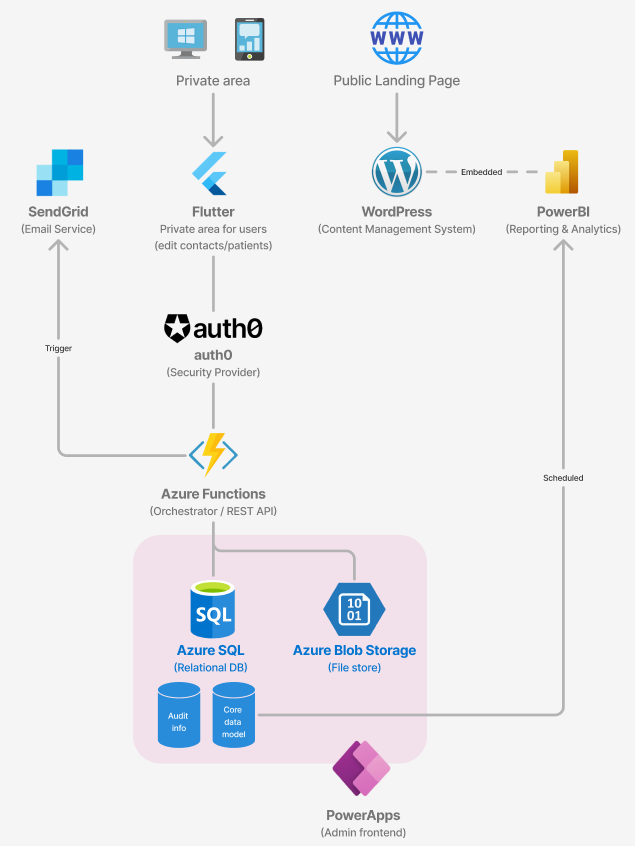

# Technical Implementation

The Rett Syndrome Patient Registry is designed to be an efficient, GDPR-compliant, and modular platform for onboarding, managing, and analyzing patient and contact information. This document provides an overview of the main technical building blocks and the tools in use, allowing contributors to understand the project context and identify areas where they can provide input or support.

## High-level architecture

The high-level architecture integrates a mix of cloud services and third-party tools to provide a secure and scalable environment. The architecture diagram below illustrates the main components and their interactions:

---

## 1. Content Management System (CMS) - WordPress

The WordPress CMS serves as the frontend for the registry, handling public-facing content and facilitating initial data intake via forms. This CMS setup is chosen for its simplicity, ease of maintenance, and extensive plugin ecosystem, making it ideal for hosting and managing content updates.

* **Technology:** WordPress (hosted on WordPress.com using Business subscription)
* **Primary Role:** Public website for informational content and registry landing page

### 1.1. Forms tool for survey management - Gravity Forms

Gravity Forms is used within WordPress to handle user data intake, from initial onboarding to ongoing survey participation. It provides flexibility in form creation and allows easy integration with Azure services for data processing and storage.

* **Primary Role:** Collecting form submissions and survey data
* **Integration:** Data submitted via Gravity Forms is processed by Azure Functions (primarily using webhooks) and stored in the Azure SQL database. It can also be accessed via REST API
* **Error Handling:** TBD, tightly linked with Azure Function timeout and retry policies

---

## 2. Secure Authentication - Auth0

The registry employs Auth0 for passwordless, secure authentication. Auth0 simplifies login management, allowing for secure access without traditional passwords, and supports two-factor authentication (2FA) for added security.

* **Primary Role:** Authentication and identity management.
* **Integration:** Enables secure access to both WordPress and the backend services.

---

## 3. Orchestrator - Azure Functions

Azure Functions act as the backend for the registry system, managing key processes such as data validation, storage, form submissions, and file uploads. Serving as the backend for PowerApps, Azure Functions support CRUD operations and enable real-time data interactions. They are triggered by events like form submissions, file uploads, and PowerApps requests, processing and securely routing data to Azure SQL or Blob Storage as needed.

This serverless, scalable setup ensures efficient processing while adapting to demand, maintaining high performance, and supporting seamless integration across the registry system.

* **Primary Role:** Data processing, orchestration of backend tasks, and handling API requests.
* **Functionality:** Integrates with Auth0 for authentication, handles data storage in Azure SQL, and triggers events for file uploads.
* **Timeout and Retry Policies:** TBD.

### Endpoints

The following endpoints serve various aspects of the patient registry, providing CRUD functionality directly accessible by PowerApps and other components. This approach eliminates the need for separate “PowerApps” endpoints by standardizing interactions across all user-facing components.

#### 3.1. User Onboarding

- **`POST /onboarding/submitForm`**: Processes form submissions for new user onboarding.
- **`POST /onboarding/verifyEmail`**: Verifies user email by handling verification token or link.

#### 3.2. Patient and Contact Management (CRUD)

These endpoints handle all CRUD operations, making them directly usable by PowerApps and other components.

- **Patient Endpoints**
  - **`POST /patients`**: Creates a new patient record.
  - **`GET /patients/{id}`**: Retrieves details for a specific patient.
  - **`PUT /patients/{id}`**: Updates patient information.
  - **`DELETE /patients/{id}`**: Soft deletes a patient record.

- **Contact Endpoints**
  - **`POST /contacts`**: Creates a new contact.
  - **`GET /contacts/{id}`**: Retrieves contact information.
  - **`PUT /contacts/{id}`**: Updates contact details.
  - **`DELETE /contacts/{id}`**: Soft deletes a contact.

- **Relationship Endpoints**
  - **`POST /relationships`**: Links a contact to a patient.
  - **`DELETE /relationships/{id}`**: Deletes a specific patient-contact relationship.

#### 3.3. File Management

- **`POST /files/upload`**: Accepts file uploads linked to a patient or contact, storing files securely in Blob Storage.
- **`GET /files/{id}`**: Retrieves files associated with a specific patient or contact.

### 3.4. Survey and Data Collection

- **`POST /surveys/submitResponse`**: Captures and stores responses from surveys, linking data back to the appropriate patient or contact.

### 3.5. Notifications and Reminders

- **`POST /notifications/sendEmail`**: Sends email notifications (e.g., for onboarding confirmation, survey invites).
- **`POST /notifications/sendSMS`**: Sends SMS notifications for reminders or verifications as needed.

### 3.6. Audit and Logging

- **`POST /audit/logActivity`**: Logs user actions and system events, ensuring a clear audit trail for regulatory compliance.

---

## 4. Storage 

### 4.1. Relational database - Azure SQL

The primary database for the registry, Azure SQL stores patient, contact, and relationship data securely. It offers flexibility for structuring longitudinal data and supports scalability for future analytical needs.

* **Primary Role:** Storing structured data like patient demographics, contact relationships, and survey responses.
* **Schema:** Initial data model setup through SQL scripts (with Terraform setup for initial provisioning).

### 4.2. File storage - Azure Blob Storage

Azure Blob Storage securely stores uploaded files (e.g., genetic reports) linked to patients. Blob Storage provides scalable and secure file management, essential for large files and GDPR-compliant storage practices.

* **Primary Role:** Secure storage for files associated with patient records.
* **File Management:** Files are linked via metadata in Azure SQL, enabling easy retrieval for processing.

#### Access Management
Blob Storage access is secured with several key controls:
* SAS Tokens: Temporary access is granted using Shared Access Signatures (SAS), generated by the backend to restrict file access based on user roles.
* Role-Based Access Control (RBAC): RBAC ensures that only specific system components, like backend services, can write or delete files, with limited permissions granted as needed.
* Network Restrictions: Private endpoints and firewall rules restrict access to known IPs within our virtual network, minimizing exposure to the public internet.

#### Encryption
To ensure data protection, Blob Storage applies encryption both at rest and in transit:
* Encryption at Rest: All files are encrypted automatically using Microsoft-managed keys (AES-256).
* Encryption in Transit: HTTPS/TLS encryption secures data transfer to and from Blob Storage, protecting data confidentiality during upload and download.

---

## 5. Admin frontend - PowerApps

PowerApps serves as the internal admin interface for managing and reviewing patient registry data. This platform allows authorized administrators to perform CRUD operations and view reports in a user-friendly, customizable interface.

* **Primary Role:** Admin portal for managing patient and contact records.
* **Access Control:** Integrated with Microsoft Authentication for secure access.
* **API Integration:** PowerApps will connect to Azure SQL using Azure Function APIs for CRUD operations and updates.

---

## 6. Reporting & Analytics - PowerBI

Power BI is used for reporting and analytics, providing a comprehensive view of patient demographics, registry growth, and survey results. It integrates directly with Azure SQL for seamless data access and visualization.

* **Primary Role:** Data analytics and visual reporting for stakeholders.
* **Data Security:** Anonymized data extracts from Azure SQL maintain privacy.

---

## 7. Notification Service (Email and SMS) - SendGrid/Twilio

To ensure effective communication with registry users, SendGrid is used for email notifications, and Twilio for SMS alerts (e.g., for two-factor authentication). These tools support both initial onboarding communications and ongoing engagement.

* **Primary Role:** Secure notification handling for verification and survey reminders.
* **Integration:** Notifications are triggered from Azure Functions to SendGrid/Twilio.

---

## 8. Networking

All Azure services are configured within a secure Virtual Network (VNet) to enhance security, ensuring all internal services communicate over private IPs. Additionally, a firewall limits traffic to only authorized IPs.

* **Primary Role:** Enabling secure communication between Azure services.
* **Configuration:** IP restrictions, Azure Virtual Network Integration, and TLS.

---

## 9. Other Azure services

### Application Insights for Monitoring

Azure Application Insights provides logging, diagnostics, and performance monitoring for Azure Functions and other backend services. It supports real-time insights, helping to optimize performance and troubleshoot issues.

* **Primary Role:** Performance monitoring and error diagnostics.
* **Use Case:** Logging and analyzing request metrics, latency, and errors.